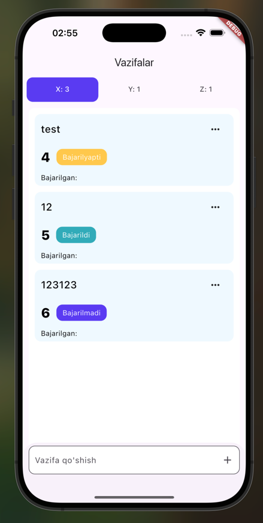
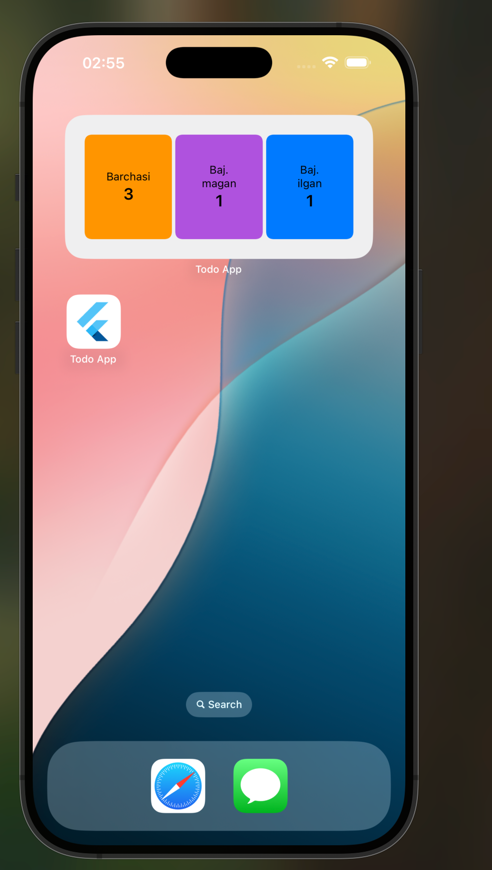

# 📋 Flutter TODO App with iOS WidgetKit Integration

Bu loyiha Flutter asosida yozilgan ToDo ilovasi bo‘lib, iOS uchun **WidgetKit** bilan integratsiya qilingan. Flutter ilovasi orqali yaratilgan statistikalar native (Swift) tarafga `MethodChannel` orqali uzatiladi va widget orqali foydalanuvchiga ko‘rsatiladi.

📹 **Demo video**:  
▶️ [YouTube Short](https://youtube.com/shorts/ZZWNL7I1pdk?feature=share)

---

## 📐 Arxitektura

Loyiha **Clean Architecture** asosida

core/
 ── features/
    ── todo/
        ── data/
        ── domain/
        ── presentation/

> Har bir qatlam `usecase`, `repository`, `bloc`, `datasource`, `model`, `entity` va `mapper` bilan ajratilgan.

  

  

